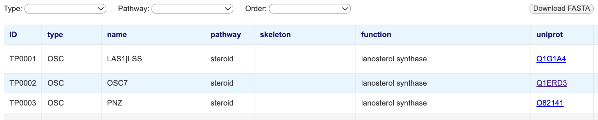

# triterpene_rdf
A database for enzymes and transcription factors related to triterpene biosynthesis in plants

## How to use the database
1. Open the following URL (https://ktamura2021.github.io/triterpene_rdf/). All entries are displayed.
2. You can filter entries using the dropdown menus at the top of the page.
3. Amino acid sequences (FASTA format) for the displayed entries can be obtained from the 'Download FASTA' button.

