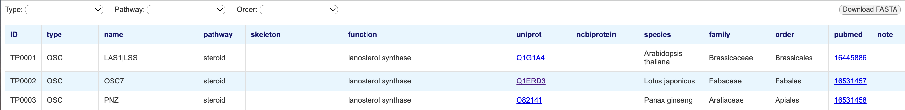

# Triterpene RDF
A database of plant enzymes and transcription factors involved in triterpene biosynthesis using the Resource Description Framework

## How to use the database
1. Open the following URL (https://ktamura2021.github.io/triterpene_rdf/). All entries are displayed.
2. You can filter entries using the drop-down menus at the top of the page.
3. Amino acid sequences (FASTA format) for the displayed entries can be obtained from the 'Download FASTA' button.

## License of the database
This work is licensed under a <a href="https://creativecommons.org/licenses/by/4.0/" target="_blank" rel="noopener noreferrer">Creative Commons Attribution 4.0 International License</a>.

## Citing Triterpene RDF
If you find Triterpene RDF useful, please cite the following preprint.

> Tamura, K., Chiba, H., Bono, H. Triterpene RDF: Developing a database of plant enzymes and transcription factors involved in triterpene biosynthesis using the Resource Description Framework. 
> bioRxiv 2024.01.08.574260; doi: [https://doi.org/10.1101/2024.01.08.574260](https://doi.org/10.1101/2024.01.08.574260)
